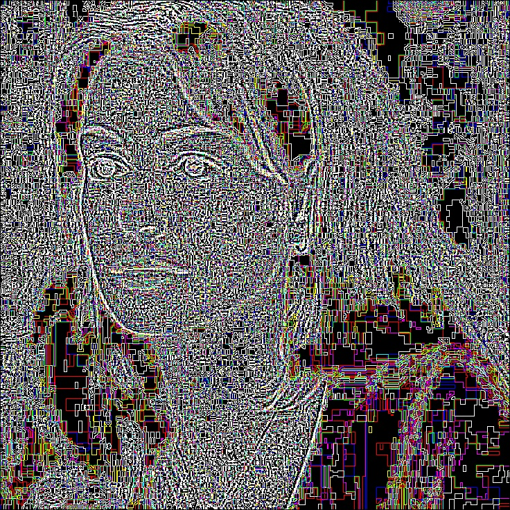

# IPAlib
A simple image processing library made to keep up with the course UCS2523

## Operations available

1) ### Invert
Inverts any given image i.e. applies `255 - [value]` for each pixel.
Example-  
```py
from core import invert
img = invert(img)
```
<div style="display: flex; align-items: center">

-> 

</div>

2) ### Threshold & Binary Threshold
The pixel value is shown only if it is above a certain threshold.
An example with `threshold = 128`-  
```py
from core import threshold
img = threshold(img, 128)
```
<div style="display: flex; align-items: center">

-> 

</div>


3) ### Correlation & Convolution
A kernel is used to take the weighted combination of every pixel around itself. Convolution and correlation essentially differ only in the fact that the kernel is transposed for convolution.  

An example convolution of a matrix-  
```py
from core import convolution
kernel = np.array([[-1,-1,-1],[-1,8,-1],[-1,-1,-1]]) # gaussian kernel
img = convolution(img, kernel)
```
<div style="display: flex; align-items: center">

-> 

</div>
